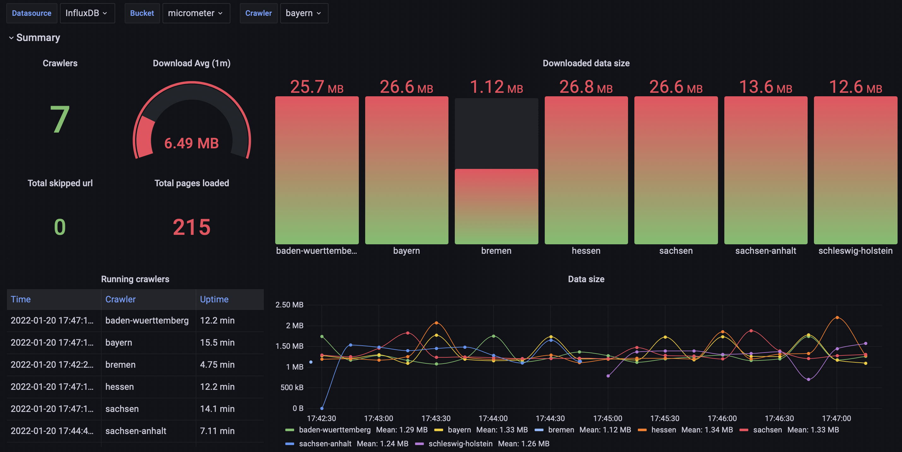

:sourcedir: ./web-crawler-lib/src/test/java

= Java Web-Crawler

This is a web crawling java library used to crawl a web domain and extract data from it pages.

- Any HTML parser can be used and `Jsoup` and `Selenide` are included.
- Supports depth and breadth traversal.
- Assignable page processing through a page predicate.
- A message-driven architecture for async page processing.
- Assignable custom messages according page processing.
- Maximum traversal depth limit.
- Filtering of the circular links and skips their pages for processing.
- Random delay in page processing.
- Persisting page source on disk.
- Backup in case of failure is supported.
- Monitoring and metrics with `Micrometer`.
- `yml` and `Fluent API` configuration are supported.

== Getting Start

. compile the library

    mvn clean install -DskipTests

TIP: Building docker image with `arm64` support use property `docker.platform.architecture` as shown below: +
+mvn clean install -DskipTests -Ddocker.platform.architecture=arm64+

. add following dependency to your `pom` file
[source,xml]
<dependency>
  <groupId>org.babich</groupId>
  <artifactId>web-crawler-lib</artifactId>
  <version>1.0.1</version>
</dependency>

. example
[source,java]
----
include::{sourcedir}/org/babich/crawler/example/WikiTitlesGrabber.java[]
----
output

    https://en.wikipedia.org/wiki/Web_crawler
        1 Nomenclature
        2 Overview
        3 Crawling policy 3.1 Selection policy 3.1.1 Restricting followed links 3.1.2 URL normalization 3.1.3 Path-ascending crawling 3.1.4 Focused crawling 3.1.4.1 Academic-focused crawler 3.1.4.2 Semantic focused crawler 3.2 Re-visit policy 3.3 Politeness policy 3.4 Parallelization policy
        3.1 Selection policy 3.1.1 Restricting followed links 3.1.2 URL normalization 3.1.3 Path-ascending crawling 3.1.4 Focused crawling 3.1.4.1 Academic-focused crawler 3.1.4.2 Semantic focused crawler
        3.1.1 Restricting followed links
        3.1.2 URL normalization
        3.1.3 Path-ascending crawling
        3.1.4 Focused crawling 3.1.4.1 Academic-focused crawler 3.1.4.2 Semantic focused crawler
        3.1.4.1 Academic-focused crawler
        3.1.4.2 Semantic focused crawler
        3.2 Re-visit policy
        3.3 Politeness policy
        3.4 Parallelization policy
        4 Architectures
        5 Security
        6 Crawler identification
        7 Crawling the deep web 7.1 Web crawler bias
        7.1 Web crawler bias
        8 Visual vs programmatic crawlers
        9 Examples 9.1 Open-source crawlers
        9.1 Open-source crawlers
        10 See also
        11 References
        12 Further reading
    https://de.wikipedia.org/wiki/Webcrawler
        1 Geschichte
        2 Technik
        3 Ausschluss von Webcrawlern
        4 Probleme
        5 Arten
        6 Siehe auch
        7 Einzelnachweise
        8 Weblinks

=== Monitoring and metrics

The library provides metrics for processing pages, services and events. Metrics can be collected in an `Influxdb` and visualized with `Grafana`. An example of deploying a test-application with monitoring is in
xref:web-crawler-test/src/main/docker/monitoring.yml[]
[source,yml]
----
include::web-crawler-test/src/main/docker/monitoring.yml[]
----
`Grafana` dashboards for `Influxdb` datasource are also available in the test-application environment.

You can use a properties file to configure the database connection and registry settings. The path to file should be passed to the class constructor, or a default value could be used for the local database instance.
The configuration via the `crawler.yml` file looks like this:

[source,yml]
----
metrics: &Metrics
    registry: !!org.babich.crawler.metrics.InfluxRegistry { propertyFile : './web-crawler-lib/src/main/resources/influx.properties' }
----

The content of property file `influx.properties` looks like below:
[source,properties]
----
influx.db=crawler
influx.uri=http://influxdb:8086
influx.step=15
influx.bucket=micrometer
influx.org=my-org
influx.token=Iou3WHVaKQdmVEsUtZniWMruRShepsJ7eZyN
----